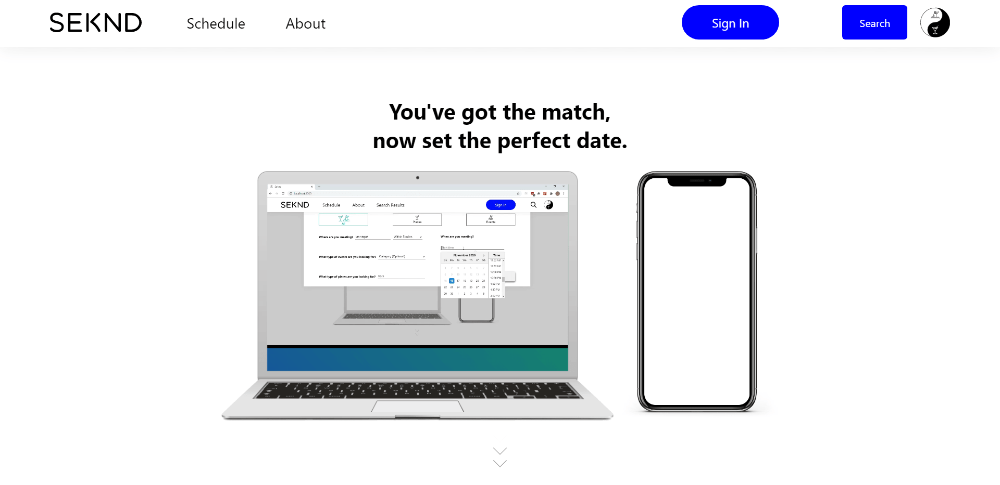

<h1 align="center">
Seknd</h1>

> Less time looking, more second dates.  

Seknd is the first "date making" app, built to make finding a first date idea as convenient as finding a match on Tinder.

**_Work in progress. Many features and designs are subject to change._**

<!-- DO NOT CHANGE -->

_Last updated on Thu, Jan 14, 2021  4:38:34 PM_

<!-- DO NOT CHANGE -->

<kbd width="74.385%">

</img>
</kbd>

<kbd width="20.615%">

</img>
</kbd>

## Contents

1. [Deployment](#Deployment)
2. [Motivation](#Motivation)
3. [Design](#Design)
4. [Features](#Features)
5. [Technologies](#Technologies)
6. [Colors](#Colors)
7. [License](#License)

## Deployment

`Type text in these blocks in your IDE's or code editor's terminal and hit enter.`

1. **Open up a new folder in the IDE or code editor of your choice (Visual Studio Code highly suggested).**
2. `git init`
3. `git clone https://github.com/grantmontgomery/sekndproduction.git`
4. **Move all files and folders outside of sekndproduction folder in to the new folder.**
5. **Delete sekndproduction folder.**
6. **Install dependencies**  

   `npm install`

7. **Run the development server**  

   `npm start` 

8. **When the build is done in the terminal a window should open up at _http://localhost:3000_ in one of your browsers, but if it doesn't visit this address in the browser of your choice.**

- Run production build.  

  `npm run build` 

- Preview production build.  

  `npm run server`

## Motivation

The past decade has defined the era of matchmaking apps and has made meeting new people fast and convenient. But the convenience and simplicity ends once you match with someone and the question comes up, "What should I plan for the first date?". In order to answer this question most of us will have to look through multiple apps such as Yelp or Eventbrite to figure out something to do within a certain area and a certain time. For professionals this is can be time consuming especially after already communicating with so many matches. I built this app with the goal of making the process of finding something to do simple, but with the ultiamte goal of eliminating the thought process totally with the use of a smart algorithm. This version is the second iteration of this idea which followed a set of design principles detailed below.

## Design

Throughout building this app

## Features

1. **Search** 

   Are you looking for places, events, or the whole shebang? The Search feature is where you begin the process of finding that great first date idea. Start by selecting what which of the three you're looking for, then where you would like to look, and when. The search feature sends a query to a dynamic route where API calls are made to serverless endpoints with the useSWR hook created by Vercel. The serverless functions then post queries to API endpoints provided by Ticketmaster and Yelp and the data is finally made available for users in the Select feature.
    

     <kbd>
   </kbd>

- **Pages**

  - [Queried Page](https://github.com/grantmontgomery/sekndproduction/blob/master/pages/search/%5Bqueried%5D.tsx)

- **Relevant Components**
  - [SearchBox](https://github.com/grantmontgomery/sekndproduction/tree/master/components/SearchBox)
  - [SearchIcon](https://github.com/grantmontgomery/sekndproduction/tree/master/components/SearchIcon)
- **Backend**
  - [Ticketmaster API](https://github.com/grantmontgomery/sekndproduction/blob/master/pages/api/ticketmasterAPI.ts)
  - [Yelp Businesses API](https://github.com/grantmontgomery/sekndproduction/blob/master/pages/api/yelpBusinessesAPI.ts)
  - [Yelp Events API](https://github.com/grantmontgomery/sekndproduction/blob/master/pages/api/yelpEventsAPI.ts)

2. **Select** 

   After making your search request and the data loads you see cards displaying the best events and places at the time you specified. From this page you can select whether you want events or places displayed. There is also pricing options on the side where you can filter the results from the cheapest to the most expensive. Keep in mind this feature changes functionality and options based on whether you're looking at places or events. This feature also implements an infinite scrolling feature where when you scroll to the bottom more results will be continuously loaded in . When you find places or events you like hit the "Add to Parts +" button on the top right. You'll see a Yin and Yang symbol at the top right pulsate. When you click on this symbol it opens up the places you selected, like a shopping cart, but for your preferred places or events. From this section you can also create your own parts if you can't find what you're looking for in the results. Your Date Parts list will remain constant on page changes and refresh because it's stored in a React Context object and the Session Storage on your browser.

   <kbd>
   </kbd>

- **Pages**
  - [Queried Page](https://github.com/grantmontgomery/sekndproduction/blob/master/pages/search/%5Bqueried%5D.tsx)
- **Relevant Components**
  - [Results Filter](https://github.com/grantmontgomery/sekndproduction/tree/master/components/ResultsFilter)
  - [Results List](https://github.com/grantmontgomery/sekndproduction/tree/master/components/ResultsList)
  - [Result Card](https://github.com/grantmontgomery/sekndproduction/tree/master/components/SearchResults/ResultCard)
  - [Date Parts](https://github.com/grantmontgomery/sekndproduction/blob/master/components/DateParts/DateParts.tsx)
  - [Date Part](https://github.com/grantmontgomery/sekndproduction/tree/master/components/DatePart)
  - [Mobile Filter](https://github.com/grantmontgomery/sekndproduction/tree/master/components/MobileFilter)
  - [Mobile Filter Widget](https://github.com/grantmontgomery/sekndproduction/tree/master/components/MobileFiltersWidget)
- **Global State**
  - [Date Parts Context](https://github.com/grantmontgomery/sekndproduction/blob/master/state/DatePartsContext.tsx)

3. **Schedule** 

   Once you have selected all the places and events you want you can visit the Schedule Page in order to schedule the perfect night or day out. A vertical grid was created from the times you originally selected in the Search feature and is split up by 30 minute increments. Tap or click on an empty space on the grid to create an outline piece. You can drag the piece, shorten, or extend it to fit the time block of your choice. Once it's in the spot you like you can select the part you would like to place inside of it from the selection on the left. If you change your mind and would like to remove the part just click or tap on the red "X" on the top right.

     <kbd>
   </kbd>

- **Pages**
  - [Schedule Page](https://github.com/grantmontgomery/sekndproduction/blob/master/pages/schedule.tsx)
- **Relevant Components**

  - [Schedule Grid](https://github.com/grantmontgomery/sekndproduction/tree/master/components/ScheduleGrid)
  - [Schedule Drag Piece](https://github.com/grantmontgomery/sekndproduction/tree/master/components/ScheduleDragPiece)
  - [Schedule Part Selector](https://github.com/grantmontgomery/sekndproduction/tree/master/components/SchedulePartSelector)

- **Global State**
  - [Grid Rectangles Context](https://github.com/grantmontgomery/sekndproduction/blob/master/state/GridRectanglesContext.tsx)
  - [Search Grid Context](https://github.com/grantmontgomery/sekndproduction/blob/master/state/SearchGridContext.tsx)

4. **Save**  
   This feature is still in the works, but it would allow users who have an account to save their scheduled nights out so that they can copy and reuse ideas for another time.

## Technologies

- **Languages**
  - [TypeScript](https://github.com/microsoft/TypeScript)
  - JavaScript
  - SQL
  - [GraphQL](https://graphql.org/)
- **Markdown**
  - HTML
- **Styling**
  - [Sass](https://github.com/sass/sass)
  - [CSS Modules](https://github.com/css-modules/css-modules)
  - CSS
- **Libraries**
  - [React.js](https://github.com/facebook/react)
- **Frameworks**
  - [Next.js](https://github.com/vercel/next.js)
- **Databases**
  - [MySQL](https://www.mysql.com/)
- **APIs**
  - [Yelp Fusion](https://www.yelp.com/developers/documentation/v3/get_started)
  - [Ticketmaster Develper](https://developer.ticketmaster.com/products-and-docs/apis/getting-started/)
- **Cloud Services**
  - [Vercel](https://vercel.com)
  - [AWS](https://aws.amazon.com)
- **Extra Tools**
  - [SWR](https://github.com/vercel/swr)

## Colors

| Color/Gradient | Hex                                                                                                                               |
| -------------- | --------------------------------------------------------------------------------------------------------------------------------- |
| Crystal Clear  | [#159957](https://via.placeholder.com/10/159957?text=+)`#159957` [#155799](https://via.placeholder.com/10/155799?text=+)`#155799` |
| Rea            | [#FFE000](https://via.placeholder.com/10/FFE000?text=+)`#FFE000` [#799F0C](https://via.placeholder.com/10/799F0C?text=+)`#799F0C` |
| Cosmic Fusion  | [#ff00cc](https://via.placeholder.com/10/ff00cc?text=+)`#ff00cc` [#333399](https://via.placeholder.com/10/333399?text=+)`#333399` |

## License

- [MIT License](https://github.com/grantmontgomery/sekndproduction/blob/master/LICENSE)
