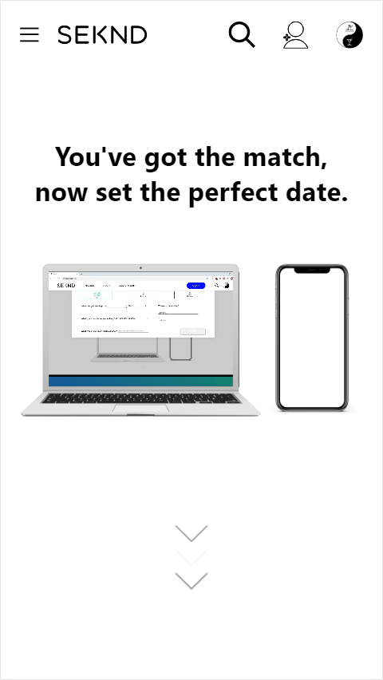

<h1 align="center">
Seknd</h1>

> Less time looking, more seocond dates.  

Seknd is the first "date making" app, built to make finding a first date idea as convenient as finding a match on Tinder.

**_Still a work in progress. Code and features are subject to change._**

<!-- DO NOT CHANGE -->

_Last updated on Tue, Jan 12, 2021  3:48:33 PM_

<!-- DO NOT CHANGE -->

<kbd>

</img>
</kbd>

<kbd>

</img>
</kbd>

## Contents

1. [Deployment](#Deployment)
2. [Motivation](#Motivation)
3. [Design](#Design)
4. [Features](#Features)
5. [Technologies](#Technologies)
6. [Colors](#Colors)
7. [License](#License)

## Deployment

`Type text in these blocks in your IDE's or code editor's terminal and hit enter.`

1. **Open up a new folder in the IDE or code editor of your choice (Visual Studio Code highly suggested).**
2. `git init`
3. `git clone https://github.com/grantmontgomery/sekndproduction.git`
4. **Move all files and folders outside of sekndproduction folder in to the new folder.**
5. **Delete sekndproduction folder.**
6. **Install dependencies**  

`npm install`

7. **Run the development server**  

`npm start` 

9. **When the build is done in the terminal a window should open up at _http://localhost:3000_ in one of your browsers, but if it doesn't visit this address in the browser of your choice.**

- Run production build.  

  `npm run build` 

- Preview production build.  

  `npm run server`

## Motivation

The past decade has defined the era of matchmaking apps and has made meeting new people fast and convenient. But the convenience and simplicity ends once you match with someone and the question comes up, "What should I plan for the first date?". Like many others we have to look through apps such as Yelp or Eventbrite to figure out something to do within a certain area and a certain time. For working professionals this is time consuming especially after already communicating with so many matches. I built this app with the goal of making the process of finding something to do simple, but with the ultiamte goal of eliminating the thought process totally with the use of a smart algorithm. This version is the second iteration of this idea which followed a set of design principles detailed below.

## Design

Throughout building this app

## Features

1. Search

2. Schedule

3. Save

## Technologies

- **Languages**
  - [TypeScript](https://github.com/microsoft/TypeScript)
  - JavaScript
  - SQL
  - [GraphQL](https://graphql.org/)
- **Markdown**
  - HTML
- **Styling**
  - [Sass](https://github.com/sass/sass)
  - [CSS Modules](https://github.com/css-modules/css-modules)
  - CSS
- **Libraries**
  - [React.js](https://github.com/facebook/react)
  - [Three.js](https://github.com/mrdoob/three.js)
- **Frameworks**
  - [Next.js](https://github.com/vercel/next.js)
- **Databases**
  - [MySQL](https://www.mysql.com/)
- **APIs**
  - [Yelp Fusion](https://www.yelp.com/developers/documentation/v3/get_started)
  - [Ticketmaster Develper](https://developer.ticketmaster.com/products-and-docs/apis/getting-started/)

## Colors

## License

- [MIT License](https://github.com/grantmontgomery/sekndproduction/blob/master/LICENSE)
